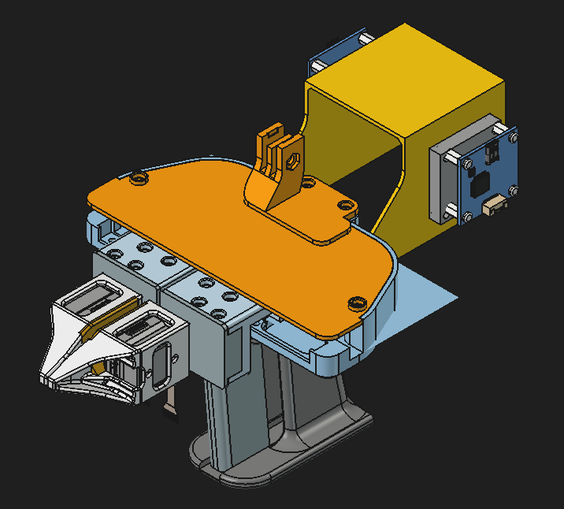
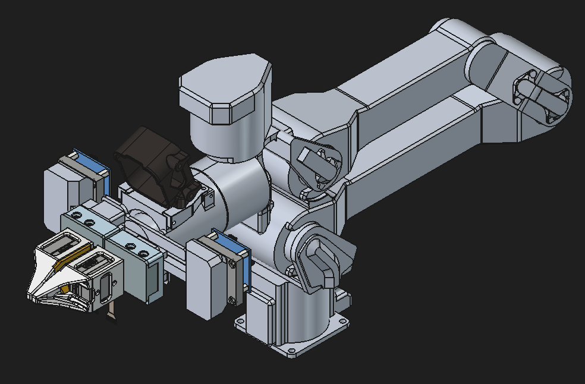

# ⚙️ Hardware CAD Models

This directory contains the CAD models (STEP files) for the custom end-effectors and sensor mounts used in the dual-arm shoe inspection system.

---

## ⚙️ Terms of Use & Licensing
This hardware design is released under a custom non-commercial license for academic research only.

❌ No Commercial Use: Direct or indirect commercial use is strictly prohibited.

❌ No Redistribution: You may not redistribute, host, or share this hardware design.

🎓 Academic Use Only: Allowed for academic research, publications, and presentations with proper attribution (XXXX).

Please read the full [LICENSE](./LICENSE) file before downloading or using this hardware design.

---

## 📂 Directory Structure

```text
cad/
├── umi/
│   ├── UMI-parts-01.step      # Custom gripper for UMI (end-effector only)
│   └── UMI-full-01.step       # Full assembly including UMI arm
└── widowx/
    ├── widowx-parts-01.step   # Custom gripper for WidowX (end-effector only)
    └── widowx-full-01.step    # Full assembly including WidowX arm
```

---

## 🤖 Hardware Overview

Each gripper design is optimized to integrate the following sensors:
* **Tactile Sensor**: GelSight Mini
* **Force/Torque Sensor**: MMS101 (6-axis F/T sensor)

### 🖐️ 1. UMI Setup (`/umi`)
* Designed for Universal Manipulation Interface (UMI) setups.

<div align="center">
  <table style="border: none; background: transparent;">
    <tr>
      <td align="center" style="border: none; padding: 10px;">
        <br>
      </td>
    </tr>
  </table>
</div>

### 🦾 2. WidowX Setup (`/widowx`)
* Designed for direct mounting onto the WidowX AI Follower arms.

<div align="center">
  <table style="border: none; background: transparent;">
    <tr>
      <td align="center" style="border: none; padding: 10px;">
        <br>
      </td>
    </tr>
  </table>
</div>

---

## 📥 File Formats
* `.step` files are provided for full modification and CAD editing.
